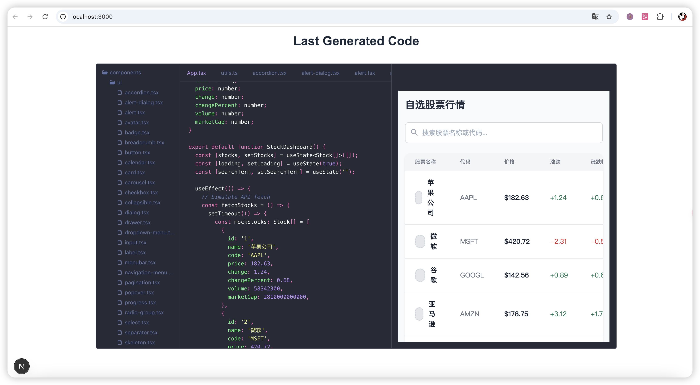

# quick-ai-coder


[View Screenshots and Demo](#screenshots-and-demo)

[中文文档](README.md)

---

## Screenshots and Demo

### Screenshots

Below are some screenshots showcasing the main features of the project:

  


### Demo Video

The following demo video illustrates the complete process from description to code generation:

  
[Click here to view the full demo video](docs/media/quick-ai-coder-demo.mov)

---

## Project Description

This project, inspired by [LlamaCoder](https://github.com/nutlope/llamacoder), aims to generate complete APP code for users using AI technology. Users simply input a description of their desired APP, click submit, and the system leverages a powerful AI model to generate the APP application and complete React project code. The project also provides features like code preview, editing, and UI rendering to help developers quickly bring their ideas to life.

---

## Features

- **Input APP Description**  
  Users can define the desired APP functionality through simple text descriptions.
- **AI-Generated APP Code**  
  The system generates complete React project code based on the description.
- **Code Preview**  
  Real-time preview of the generated code's effects.
- **Code Editing**  
  Online editing functionality allows users to adjust the generated code.
- **Code Build and UI Rendering**  
  Supports code building and rendering of the final UI.

---

## Tech Stack

| Component    | Technology | Description                              |
|--------------|------------|------------------------------------------|
| Frontend/Backend Framework | [Next.js](https://nextjs.org/)    | For building high-performance full-stack applications |
| AI Model     | [Deepseek](https://deepseek.com/)   | Provides powerful code generation capabilities |
| Code Preview | [Sandpack](https://sandpack.codesandbox.io/)   | Enables real-time code preview and interaction |

---

## Installation and Usage

1. **Install Dependencies**  
   Run the following command to install the required dependencies:
   ```bash
   pnpm install
   ```

2. **Add AI API Key**  
   Create a `.env` file in the project root directory and add the following content:
   ```
   DEEPSEEK_AI_API_KEY=your-api-key
   ```

3. **Run the Project**  
   Start the development server:
   ```bash
   pnpm dev
   ```

4. **Access Locally**  
   Open your browser and visit [http://localhost:3000](http://localhost:3000)

---

## Contribution Guide

We welcome suggestions and contributions to this project! Please follow these steps:

1. Fork this repository  
2. Create a new branch: `git checkout -b feature/your-feature`  
3. Commit your changes: `git commit -m 'Add your feature'`  
4. Push the branch: `git push origin feature/your-feature`  
5. Submit a Pull Request

---

## License

This project is open-sourced under the MIT license. See the [LICENSE](LICENSE) file for details.
