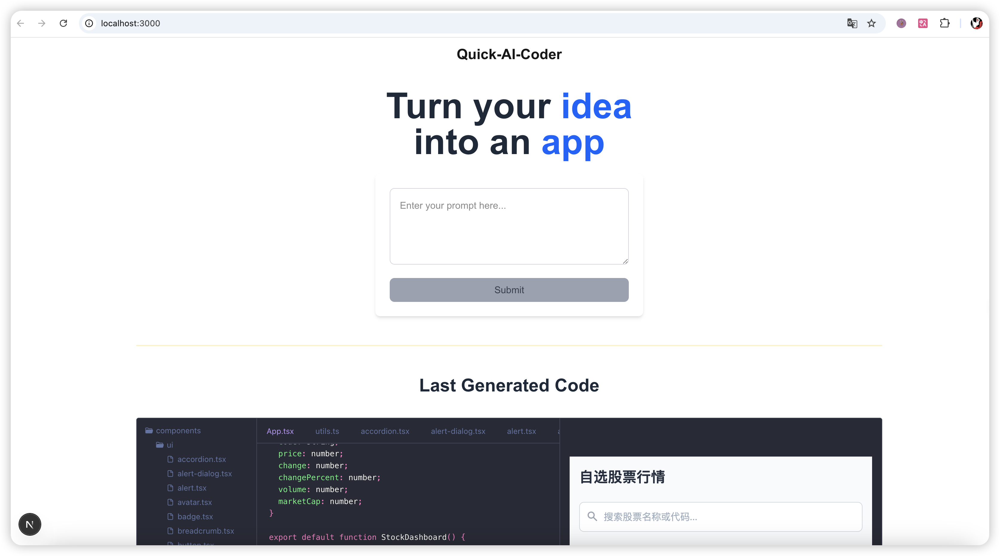

# quick-ai-coder


[查看项目截图和演示](#项目截图和演示)

[English Documentation](README-en.md)

---

## 项目简介

这是一个受 [LlamaCoder](https://github.com/nutlope/llamacoder) 启发的项目，旨在通过 AI 技术为用户生成完整的 APP 代码。用户只需输入 APP 的描述，点击提交，系统即可利用强大的 AI 大模型生成 APP 应用及完整的 React 项目代码。项目还提供代码预览、编辑和 UI 渲染等功能，帮助开发者快速实现创意。

---

## 功能亮点

- **用户输入 APP 描述**：通过简单的文本描述定义 APP 功能。
- **AI 生成 APP 代码**：基于描述生成完整的 React 项目代码。
- **代码预览**：实时预览生成的代码效果。
- **代码编辑**：在线编辑功能，支持调整生成的代码。
- **代码构建和 UI 渲染**：支持代码构建并渲染最终的 UI。

---

## 技术栈

| 部分       | 技术       | 描述                           |
|------------|------------|--------------------------------|
| 前后端框架 | [Next.js](https://nextjs.org/)    | 用于构建高性能的前后端一体化应用 |
| AI 模型    | [Deepseek](https://deepseek.ai/)   | 提供强大的代码生成能力         |
| 代码预览   | [Sandpack](https://sandpack.codesandbox.io/)   | 实现实时代码预览和交互         |

---

## 快速开始

### 安装和运行

1. **安装依赖**  
   ```bash
   pnpm install
   ```

2. **添加 AI 的 API Key**  
   在项目根目录下创建 `.env` 文件，并添加以下内容：
   ```
   DEEPSEEK_AI_API_KEY=你的API密钥
   ```

3. **运行项目**  
   ```bash
   pnpm dev
   ```

4. **本地访问**  
   打开浏览器并访问 [http://localhost:3000](http://localhost:3000)

---

## 项目截图和演示

### 截图

  


### 演示视频

  
[点击查看完整演示视频](docs/media/quick-ai-coder-demo.mov)

---

## 贡献指南

欢迎对本项目提出建议或贡献代码！请遵循以下步骤：

1. Fork 本仓库  
2. 创建一个新的分支：`git checkout -b feature/your-feature`  
3. 提交更改：`git commit -m 'Add your feature'`  
4. 推送分支：`git push origin feature/your-feature`  
5. 提交 Pull Request

---

## 许可证

本项目基于 MIT 许可证开源，详情请参阅 [LICENSE](LICENSE) 文件。
